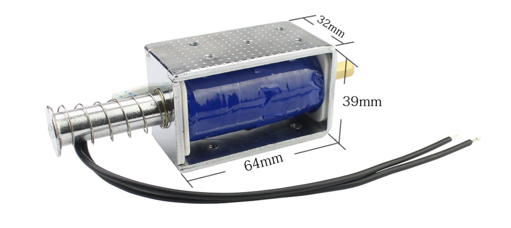

Bike lock development log
=

When I went to school, I ride a bike, but I didn't lock my bike.  
That why I dicide to make a auto bike lock.

*Note: *diagonal word is what I have.*  
*Note2: Solenoid is 12V.(Arduino's output: 5v)  

* Pats list
    * [Solenoid*2](https://t.ly/9C-sr)
    * *Arduino Uno*
    * *hc-06(Bluetooth)*
    * *hc-05(Bluetooth)*
    * Arduino Nano(https://t.ly/7SXEn)
    * *gyro senser*
    * *buzzer*
    * 3D printed thing
    * *two breadboard*
    * *jumper cables*
    * 9v battery
    * Rechargeable 9v battery (https://t.ly/Uk5Wm)
    * [9v battery AC adapter](https://t.ly/9kyuR)
    * *USB A <-> USB MICO B* 
    * [solar charger](https://t.ly/YcdLv)
    * 9v battery DC adapter
  
Solenoid


At first, I planned to use a solenoid, but it failed because it had to be pressed by hand.    
BlueTooth connect code
```c
#include <SoftwareSerial.h>

SoftwareSerial bluetooth(2, 3); //BlueTooth(Rx, Tx)

void setup() {
  Serial.begin(9600);
  bluetooth.begin(9600);
}

void loop() {
  if (bluetooth.available()){
    Serial.write(bluetooth.read());
  }
  if (Serial.available()){
    bluetooth.write(Serial.read());
  }
}

```

Final Code
```c
#include <SoftwareSerial.h>

SoftwareSerial bluetooth(2, 3); //BlueTooth(Rx, Tx)

void setup() {
  Serial.begin(9600);
  bluetooth.begin(9600);
  pinMode(4, OUTPUT);
  pinMode(5, INPUT); //state
}

void loop() {
  if (bluetooth.available()){
    Serial.write(bluetooth.read());
  }
  if (Serial.available()){
    bluetooth.write(Serial.read());
  }
  if(digitalRead(5)){
    digitalWrite(4, HIGH); 
  }else {
    digitalWrite(4, LOW);
  }
}
```